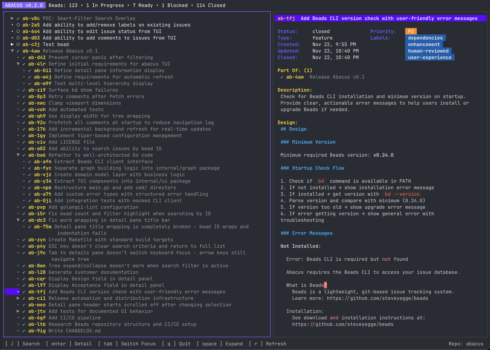

# Abacus

A powerful terminal UI for visualizing and navigating [Beads](https://github.com/steveyegge/beads) issue tracking projects.

[](https://github.com/ChrisEdwards/abacus/releases)
[](https://golang.org/dl/)
[](./LICENSE)

## Overview

Abacus transforms your Beads issue database into an interactive, hierarchical tree view right in your terminal. It provides an intuitive interface for exploring complex dependency graphs, viewing issue details, and understanding project structure at a glance.

**[📚 Read the Full Documentation](docs/index.md)**

## Preview



*Abacus showing a hierarchical tree view of Beads issues with the detail panel displaying comprehensive issue information.*

## Features

- **Hierarchical Tree View**: Visualize parent-child relationships and dependencies in an expandable tree structure
- **Smart Sorting**: Automatically prioritizes in-progress and ready-to-work issues
- **Status Indicators**: Color-coded icons show issue status at a glance
  - `◐` In Progress (cyan)
  - `○` Open/Ready (white)
  - `✔` Closed (gray)
  - `⛔` Blocked (red)
- **Rich Detail Panel**: View comprehensive issue information including:
  - Metadata (status, type, priority, labels, timestamps)
  - Full description with markdown rendering
  - Parent/child relationships
  - Blocking dependencies
  - Comments with timestamps
- **Live Search**: Filter issues by title with instant results
- **Dual-Pane Interface**: Navigate the tree while viewing detailed information
- **Smart Layout**: Responsive design with text wrapping and viewport management
- **Statistics Dashboard**: Real-time counts of total, in-progress, ready, blocked, and closed issues

## Quick Start

### Prerequisites

- [Beads CLI](https://github.com/steveyegge/beads) v0.24.0 or later installed and initialized in your project (`bd --version`)
- Go 1.25.3 or later (only required for `go install` or building from source)

### Installation

**Option 1: Homebrew (macOS/Linux) - Recommended**
```bash
brew tap ChrisEdwards/tap
brew install abacus
```

**Option 2: Install Script (Unix/macOS/Linux)**
```bash
curl -fsSL https://raw.githubusercontent.com/ChrisEdwards/abacus/main/scripts/install.sh | bash
```

**Option 3: Install Script (Windows PowerShell)**
```powershell
irm https://raw.githubusercontent.com/ChrisEdwards/abacus/main/install.ps1 | iex
```

**Option 4: Go Install**
```bash
go install github.com/ChrisEdwards/abacus/cmd/abacus@latest
```

**Option 5: Download Binary**

Download the latest release for your platform from [GitHub Releases](https://github.com/ChrisEdwards/abacus/releases).

**Option 6: Build from Source**
```bash
git clone https://github.com/ChrisEdwards/abacus.git
cd abacus
make build
```

For detailed installation instructions, including platform-specific notes, see the **[Installation Guide](docs/installation.md)**.

## Usage

Navigate to any directory containing a Beads project and run:

```bash
abacus
```

The application will automatically load all issues from your `.beads/` database.

### Command-Line Options

```bash
abacus [options]

Options:
  --db-path string            Path to the Beads database file
  --auto-refresh              Enable automatic background refresh (default: true)
  --no-auto-refresh           Disable automatic background refresh
  --refresh-interval duration Interval for automatic refresh (default: 3s)
  --output-format string      Detail panel style: rich, light, plain (default: "rich")
  --json-output               Print issue data as JSON and exit
  --skip-version-check        Skip Beads CLI version validation (or set AB_SKIP_VERSION_CHECK=true)
```

**[📖 See the complete User Guide](docs/user-guide.md)** for detailed feature documentation.

## Keyboard Shortcuts

| Action | Keys | Description |
|--------|------|-------------|
| **Navigate** | `↑/k` `↓/j` | Move cursor up/down |
| **Expand/Collapse** | `→/l` `←/h` or `Space` | Expand/collapse nodes |
| **Detail Panel** | `Enter` | Toggle detail panel |
| **Switch Focus** | `Tab` | Switch between tree and detail |
| **Search** | `/` | Enter search mode |
| **Clear Search** | `Esc` | Clear search filter |
| **Quit** | `q` or `Ctrl+C` | Exit application |

**Detail Panel Navigation (when focused):**
- `↑/↓` or `j/k` - Scroll line by line
- `Ctrl+F/B` or `PgDn/Up` - Page up/down
- `g/G` or `Home/End` - Jump to top/bottom

## Configuration

Abacus can be configured via:
- Configuration files (`~/.config/abacus/config.yaml` or `.abacus/config.yaml`)
- Environment variables (prefixed with `AB_`)
- Command-line flags

**Example configuration:**
```yaml
auto-refresh: true
refresh-interval: 3s
output:
  format: rich
database:
  path: .beads/beads.db
skip-version-check: false
```

**[⚙️ Configuration Guide](docs/configuration.md)** for complete options and precedence rules.

## Documentation

Comprehensive documentation is available in the [`docs/`](docs/) directory:

- **[Getting Started](docs/getting-started.md)** - Quick start guide
- **[Installation](docs/installation.md)** - Platform-specific installation
- **[User Guide](docs/user-guide.md)** - Complete feature reference
- **[Configuration](docs/configuration.md)** - Customization options
- **[Troubleshooting](docs/troubleshooting.md)** - Common issues
- **[Architecture](docs/architecture.md)** - Technical overview

## How It Works

Abacus interfaces with the Beads CLI to:

1. Load all issues from your project with `bd list --json`
2. Fetch full details for each issue with `bd show`
3. Build a dependency graph based on parent-child and blocking relationships
4. Render an interactive TUI using [Bubble Tea](https://github.com/charmbracelet/bubbletea)

The graph automatically identifies root nodes (issues with no parents or deepest parents in the hierarchy) and organizes the tree to minimize visual depth while accurately representing all relationships.

**[🏗️ Architecture Documentation](docs/architecture.md)** for technical details.

## Architecture

Abacus is built with:

- **[Bubble Tea](https://github.com/charmbracelet/bubbletea)**: The Elm Architecture for Go TUIs
- **[Bubbles](https://github.com/charmbracelet/bubbles)**: TUI components (viewport, text input)
- **[Lipgloss](https://github.com/charmbracelet/lipgloss)**: Style definitions and layout
- **[Glamour](https://github.com/charmbracelet/glamour)**: Markdown rendering for descriptions

The codebase is organized into logical sections:
- Style definitions (colors, text styles, layout styles)
- Data structures (Issue, Node, Stats)
- Graph building logic (dependency resolution, tree construction)
- TUI logic (Bubble Tea Model/View/Update pattern)
- Rendering utilities (text wrapping, formatting, viewport management)

## Why Abacus?

While the Beads CLI is powerful for managing issues, complex projects with many dependencies can be difficult to visualize. Abacus solves this by:

- Showing the full project structure at a glance
- Making dependencies and blockers immediately visible
- Providing context-aware navigation
- Offering rich, formatted issue views without leaving the terminal

## Troubleshooting

Having issues? Check the **[Troubleshooting Guide](docs/troubleshooting.md)** for solutions to common problems:

- Installation issues
- Database connectivity
- Display problems
- Performance tuning
- Terminal compatibility

## Contributing

Contributions are welcome! Areas for improvement:

- Additional filtering options (by status, priority, labels)
- Export views (to markdown, JSON, etc.)
- Bulk operations on selected issues
- Integration with git for change tracking
- Performance optimizations for very large issue sets

See the **[Architecture Documentation](docs/architecture.md)** for technical details about the codebase.

### Development

```bash
# Clone the repository
git clone https://github.com/yourusername/abacus.git
cd abacus

# Run tests
make test

# Run linter
make lint

# Build
make build
```

For information about creating releases, see **[RELEASING.md](RELEASING.md)**.

## License

This project is licensed under the [MIT License](./LICENSE).

## Acknowledgments

Built with excellent TUI libraries from [Charm](https://github.com/charmbracelet).
Designed for use with [Beads](https://github.com/beadscli/beads).
